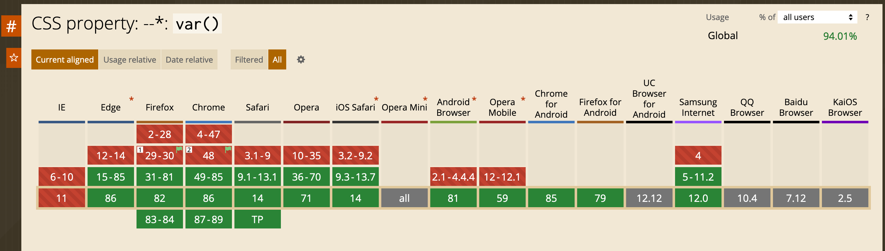

# css变量var()的理解和应用

> 目前市面上项目的前端样式构建基本都是用`sass/less/stylus`等css 的预编辑工具，而使用这些编辑工具的最方便的一点就是其具有强大的变量功能，使样式书写能全局统一定义，这样修改和后期的维护都会很方便。  
> 而随着发展，css工作组页跟进了css变量规范制定，并且目前已经适配了市面上主流浏览器，使我们做一些项目也可以不用引入预处理工具，使用本身的css `var()`，完成想要的效果。

### `var()` 定义
`var()`函数可以代替元素中任何属性中的值的任何部分。`var()`函数不能作为属性名、选择器或者其他除了属性值之外的值。（这样做通常会产生无效的语法或者一个没有关联到变量的值。）

* 首先看一个演示： 

<slot name="cssVar1"></slot>

上边的 `--bg-red`定义一个变量值，在需要的样式中使用`var()` 调用使用，`var()`内部可以定义备用值，以逗号`,`分割，如果前边的变量未定义，则会使用后边的值替代，替代值可以由多个。 具体语法如下：

###  语法

方法的第一个参数是要替换的自定义属性的名称。函数的可选第二个参数用作回退值。如果第一个参数引用的自定义属性无效，则该函数将使用第二个值。  

```
var( <custom-property-name> , <declaration-value>? )
```

** 注意 ** ：自定义属性的回退值允许使用逗号。例如， var(--foo, red, blue) 将red, blue同时指定为回退值；即是说任何在第一个逗号之后到函数结尾前的值都会被考虑为回退值。

#### 参数说明：
* ** `<custom-property-name>` 自定义属性名 **
  在实际应用中它被定义为以两个破折号开始的任何有效标识符。 自定义属性仅供作者和用户使用; CSS 将永远不会给他们超出这里表达的意义。
* ** `<declaration-value>` 声明值（后备值） **
  回退值被用来在自定义属性值无效的情况下保证函数有值。回退值可以包含任何字符，但是部分有特殊含义的字符除外，例如换行符、不匹配的右括号（如)、]或}）、感叹号以及顶层分号（不被任何非var()的括号包裹的分号，例如var(--bg-color, --bs;color)是不合法的，而var(--bg-color, --value(bs;color))是合法的）。

### 兼容性

`var()` 兼容目前主流的浏览器，具体如下图：


### 使用方法

我们可以通过`var()`来更加理解css的权重
如下例子：
<slot name="cssWeights"></slot>